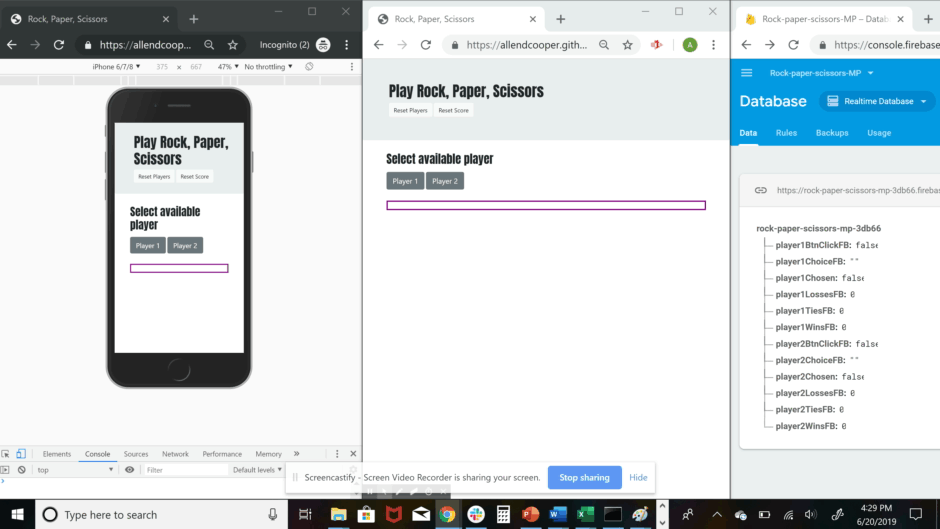

# Rock-Paper-Scissors
Two-player rock, paper, scissors game

[https://allendcooper.github.io/Rock-Paper-Scissors/](https://allendcooper.github.io/Rock-Paper-Scissors/)

## Overview
I. Using HTML and Bootstrap, created page structure with elements for the following:

1. jumbotron header with buttons for "reset players" and "reset game"

2. section for selecting an available player, with a button for player1 and a button for player2

3. a paragraph that contains the game directions

4. sections for each player's game buttons, that include individual buttons for rock, paper, and scissors, with their values stored as data-value attributes in the button element

5. sections for each player's scoreboard, formatted using a Bootstrap grid layout

II. Used JavaScript and jQuery library with Firebase and local storage to write game logic:

1. Wrote click handlers for "player1-chosen" and "player2-chosen" buttons, that when clicked, set boolean variables to "true" in both Firebase and in local storage, and that show the hidden gameboard for the player selected

2. Wrote showPlayerButtons function that is called upon page load and that uses a Firebase watcher to notice when the boolean playerChosen variables change value in the database. This function then shows/hides the available player buttons and directions text in the HTML based on the combination of boolean values.

3. Wrote click handlers for the player's rock, paper, and scissors player-buttons so that when clicked, the attribute's data-value is stored in Firebase and printed to the page, and a boolean variable indicating whether a choice had been made is also stored in Firebase

4. Wrote a scoreRoundListener function that watches the Firebase database and runs scoreRound function when both players have chosen rock, paper, or scisssors

5. Wrote scoreRound function that evaluates whether player1 or player 2 won (or tied), updates scoreboard variables in Firebase, and then runs a function updateScoreBoard to print the results onto the page.

6. Created click handler for reset-score button that runs a resetScore function when clicked--this function resets the firebase database scoreboard variables

7. Created click handler for reset-players button that runs a resetPlayers function when clicked--this function resets both player

8. Wrote reloadPlayer function that runs upon page load, and that remembers, by calling local storage, if the user has already selected player1 or player 2

### Functionality

